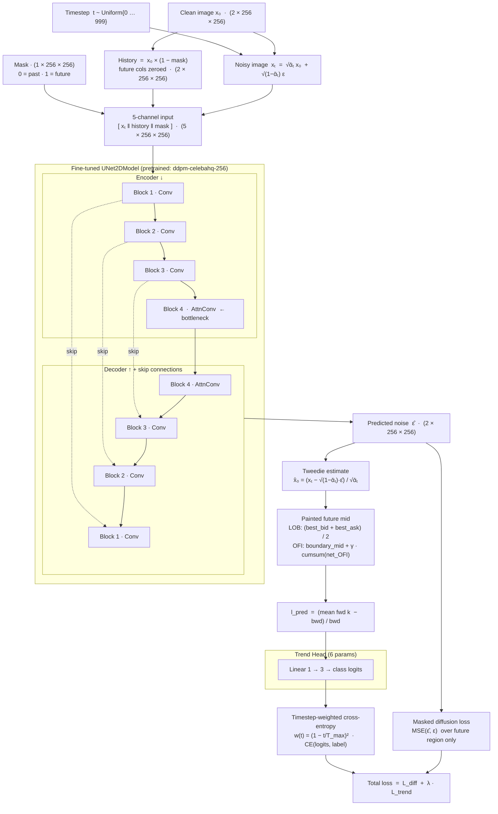
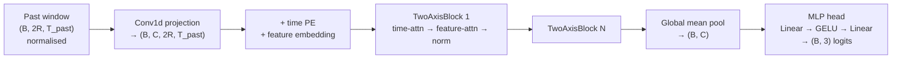
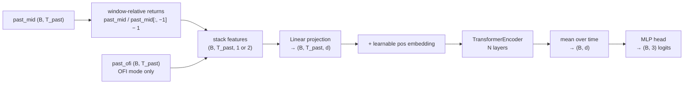

# Penny

Penny explores three approaches for **price-direction forecasting on cryptocurrency limit order books (LOBs)**. All three share the same raw data, DeepLOB trend labels, and 70/15/15 temporal split; they differ in what they model and how:

| Approach | Package | Task | Output |
|---|---|---|---|
| **Painting** | `src/painting/` | Inpaint the future LOB image with a diffusion UNet; reconstruct mid-price; classify direction | Softmax probs `{down, stat, up}` via sampled futures |
| **CSDI** | `src/csdi/` | Two-axis transformer over the full multivariate LOB past window → direct 3-class logits | Softmax probs `{down, stat, up}` |
| **TimesFM** | `src/timesfm/` | Transformer over past mid-price returns (+ optional net OFI) → direct 3-class logits | Softmax probs `{down, stat, up}` |

Trained on 10-second order-book snapshots of **BTC/IRT from Nobitex** (Iranian crypto exchange).

---

## Table of Contents

1. [Features](#1-features)
2. [Labels — DeepLOB Trend Direction](#2-labels--deeplob-trend-direction)
3. [Data, Splitting, and Windowing](#3-data-splitting-and-windowing)
4. [Normalization](#4-normalization)
5. [Models and Loss](#5-models-and-loss)
6. [Training](#6-training)
7. [Evaluation](#7-evaluation)
8. [Setup and Usage](#8-setup-and-usage)
9. [SLURM](#9-slurm)
10. [Configuration](#10-configuration)
11. [Project Structure](#11-project-structure)
12. [References](#12-references)

---

## 1. Features

### Raw data

| File | Columns |
|---|---|
| `*_orderbook.csv` | `time`, `bid_price_i`, `bid_volume_i`, `ask_price_i`, `ask_volume_i` for i = 1…n_levels |
| `*_trades.csv` | `trade_time`, `price`, `volume`, `direction` (buy/sell) |

Snapshots are captured every 10 seconds. Default depth: **n_levels = 10** per side.

---

### Multivariate LOB row stream — used by Painting and CSDI

Both approaches build a `(N_snapshots, R, 2)` feature tensor where **R = 2·n_levels + 3 = 23** rows and **2** channels.

#### Row layout

Rows run from the deepest bid (row 0) to the tightest spread at the centre, then out to the deepest ask:

| Row range | Side | Order |
|---|---|---|
| 0 … n−1 | Bid | deepest (row 0) → best bid (row n−1) |
| n … 2n−1 | Ask | best ask (row n) → deepest (row 2n−1) |
| 2n, 2n+1, 2n+2 | Trades | trade summary rows |

#### Channel 0 — flow (`feature_mode`)

**OFI mode (default):** per-level **Cont Order Flow Imbalance** (Cont et al. 2014).

For each level i at each snapshot:

- **Bid OFI (`bofi_i`):** `+new_vol` if bid price improved (moved up), `+Δvol` if unchanged, `−prev_vol` if worsened. Positive = bid liquidity added.
- **Ask OFI (`aofi_i`):** mirror logic (tightening ask = buying pressure). Positive = ask liquidity added.
- First snapshot has no predecessor — OFI is forced to zero.

**LOB mode:** channel 0 carries raw `bid_price_i` (bid rows) and `ask_price_i` (ask rows). No mid subtraction.

#### Channel 1 — state

- Bid rows: `+bid_volume_i` (resting depth, positive)
- Ask rows: `−ask_volume_i` (resting depth, negative)
- Trade rows (channel 1 only; channel 0 = 0):
  - Row 2n: `log(1 + total_trade_volume)` in the preceding `snapshot_interval_sec` seconds
  - Row 2n+1: buy-volume ratio (fraction of volume that was buyer-initiated; 0.5 if no trades)
  - Row 2n+2: buy-count ratio (fraction of trade count that was buyer-initiated; 0.5 if no trades)

#### Image construction (Painting only)

The past window slice `(T_past, R, 2)` is transposed to `(R, T_past, 2)` and square-padded to `(R_padded, T_total, 2)` = `(256, 256, 2)` by repeating rows round-robin along the height axis. The mapping from original row index to padded row slice is stored as `level_starts`.

Final image tensor: `(2, 256, 256)` — two channels, square.

---

### TimesFM features — used by TimesFM only

TimesFM is a lightweight classifier. It does not use the full row stream.

**mid-price series:** `mid[t] = (bid_price_1[t] + ask_price_1[t]) / 2`

**Window-relative returns:** the model normalises by the last observed mid-price so the input is stationary:
```
past_returns[t] = past_mid[t] / past_mid[T_past − 1] − 1
```
The series always ends at 0. This makes the input price-scale invariant.

**Net OFI (OFI mode only):** best-level net order flow imbalance per snapshot:
```
net_ofi = aofi_best − bofi_best
```
This is z-score normalised using training-split mean and std (stored in checkpoint for inference). In OFI mode the model receives `(past_returns, net_ofi)` as a 2-channel sequence; in LOB mode it receives only `past_returns`.

---

## 2. Labels — DeepLOB Trend Direction

Following Ntakaris et al. (2018), each window receives a **3-class direction label** derived from the smoothed mid-price across the window boundary.

### Trend ratio

```
bwd  = mean(mid[T_past − k : T_past])     # mean of last k past mids
fwd  = mean(mid[T_past : T_past + k])     # mean of first k future mids
l    = (fwd − bwd) / bwd                  # fractional price change
```

Default `label_k = 10` → 100-second smoothing on each side of the boundary.

### Class assignment

| Label | Condition | Integer |
|---|---|---|
| Down | l < −α | 0 |
| Stationary | \|l\| ≤ α | 1 |
| Up | l > α | 2 |

### Alpha calibration

`α` is set to the **33.3rd percentile of |l|** across all training windows. This produces approximately equal class frequencies (one third each). Alpha is frozen after training and saved in the checkpoint. Setting `label_alpha = −1` in the config triggers auto-calibration (recommended); any positive value overrides it.

---

## 3. Data, Splitting, and Windowing

### Exchanges and pairs

| Exchange | Pairs |
|---|---|
| Nobitex | BTCIRT, USDTIRT |
| Bitpin | BTC_IRT, USDT_IRT |
| Wallex | BTCTMN, USDTTMN |
| Tabdeal | BTCIRT, USDTIRT |
| Ramzinex | BTC_IRT, USDT_IRT |

IRT and TMN both denote Iranian Toman (different naming conventions per exchange). Default training target: **Nobitex BTCIRT**.

### Temporal split

Snapshots are divided by index with **no random shuffling**:

| Split | Fraction | Purpose |
|---|---|---|
| Train | 70% | Feature fitting, model training |
| Val | 15% | Early stopping, hyperparameter choice |
| Test | 15% | Final reported metrics |

### Sliding windows

Within each split, windows of length `T_total = T_past + T_future` are extracted every `stride` snapshots. With the default `stride = 5` (50 seconds), consecutive windows overlap heavily, multiplying the number of training examples significantly.

**Day-boundary skipping:** any window whose first and last snapshot fall on different calendar days is discarded to avoid spanning midnight.

Default window sizes: **T_past = 156** (26 min), **T_future = 100** (17 min), **T_total = 256** (43 min).

> **Why stride matters:** With 104 k snapshots and 70% for training, `stride = 30` yields only ~2 400 training windows — too few for a transformer. `stride = 5` yields ~14 000; `stride = 1` yields ~70 000. Use the smallest stride your compute budget allows.

---

## 4. Normalization

**Painting and CSDI** use a `RollingNormalizer` — per-row, per-channel z-score fit on the last `norm_window_snapshots` (default 8 640 ≈ 1 day) of the training split, then frozen:

1. Compute `mean` and `std` per `(row, channel)` over the fitting window.
2. Z-score: `z = (x − mean) / std`.
3. Clip at the 95th percentile of `|z|` observed over the full training set.
4. Cast to float32.

No training statistics touch val or test data. The normalizer is saved in every checkpoint.

**TimesFM** does not use the `RollingNormalizer`. Instead:
- Mid-price: normalised inside the model as window-relative returns (no stored stats needed).
- Net OFI: z-score normalised with training-split mean/std, stored in the checkpoint as `ofi_stats`.

---

## 5. Models and Loss

### Painting — Diffusion Inpainting

**What it does:** treats the LOB window as a 2-channel image, masks the future region, and inpaints it using a fine-tuned pretrained diffusion UNet (DDPM + DDIM + RePaint). The inpainted future image is decoded back to a mid-price series, from which a trend ratio `l` is computed and mapped to a direction via a TrendHead.

**Backbone:** `UNet2DModel` loaded from `google/ddpm-celebahq-256`. Input/output channels are adapted (`3→5 in`, `3→2 out`) with `ignore_mismatched_sizes=True` — the first and last conv layers are re-initialised; all inner layers retain pretrained weights.

**UNet inputs (5 channels):**

| Channels | Content |
|---|---|
| 0–1 | Noisy image xₜ (2 ch) |
| 2–3 | History = x₀ × (1 − mask) — past known, future zeroed (2 ch) |
| 4 | Inpainting mask (1 ch) |

**UNet output:** predicted noise ε̂ `(2, 256, 256)`.

**Diffusion process:**
- **Forward (training):** linear-β DDPM, β₁ = 0.0001 → β₁₀₀₀ = 0.02. `xₜ = √ᾱₜ · x₀ + √(1−ᾱₜ) · ε`.
- **Reverse (inference):** 50 deterministic DDIM steps with RePaint re-pasting of the known past at each step.



**OFI mode mid reconstruction:** channel 0 carries OFI, not prices. The future mid is recovered by integrating the generated net best-level OFI scaled by a coefficient γ (OLS slope of Δmid on net OFI, fit on training and frozen). In LOB mode the price channel is read directly.

**Loss:**
```
L_diff  = (1 / |future pixels|) · Σ_{future} (ε̂ − ε)²     # masked, future region only
L_trend = w(t) · CE(TrendHead(l_pred), label)               # w(t) = (1 − t/T_max)²
L       = L_diff + λ · L_trend                              # λ = 0.5
```

The timestep weight `w(t)` suppresses the trend gradient when t is large (high noise, low signal in x̂₀). At inference, `n_samples` futures are generated and the modal label is returned.

---

### CSDI — Multivariate Transformer Classifier

**What it does:** takes the full multivariate LOB past window and classifies direction directly — no price forecasting, no diffusion.

**Input:** `(B, 2R, T_past)` — all 2·R = 46 feature rows (2 channels × 23 rows) over the T_past past snapshots, z-score normalised.

**Output:** `(B, 3)` class logits.

**Architecture:** a stack of `csdi_layers` `TwoAxisBlock`s, each applying:
1. **Time-axis multi-head attention** — across the T_past time dimension for each feature row
2. **Feature-axis multi-head attention** — across the 2R feature rows at each time step
3. Group norm + residual (scaled by 1/√2)

After the final block, the tensor is mean-pooled over both the feature and time dimensions to a `(B, C)` vector, then passed through a 2-layer MLP head to produce `(B, 3)` logits.



**Loss:**
```
L = CrossEntropy(logits, label)
```
No price regression. No TrendHead. No diffusion.

---

### TimesFM — Univariate Transformer Classifier

**What it does:** classifies price direction from the past mid-price returns series. In OFI mode, best-level net OFI is added as a second input channel.

**Input:**
- `past_returns` `(B, T_past)` — window-relative mid-price returns (always)
- `past_ofi` `(B, T_past)` — z-score normalised net OFI (OFI mode only)

These are stacked to `(B, T_past, n_features)` where n_features = 2 (OFI) or 1 (LOB).

**Output:** `(B, 3)` class logits.

**Architecture:** a self-contained transformer encoder (no external pretrained prior):

1. Linear projection: `(B, T_past, n_features)` → `(B, T_past, d)`
2. Learnable positional embedding `(1, T_past, d)` added
3. `timesfm_layers` standard `TransformerEncoderLayer`s (`batch_first=True`, GELU activation)
4. Mean pooling over time: `(B, T_past, d)` → `(B, d)`
5. MLP head: `Linear → GELU → Linear` → `(B, 3)` logits



**Loss:**
```
L = CrossEntropy(logits, label)
```
No price regression. No pretrained TimesFM prior. No blend parameter.

In LOB mode (`feature_mode = "lob"`), only `past_returns` is used — the OFI channel is omitted.

---

## 6. Training

### Optimizer and schedule (all approaches)

- **AdamW**, peak lr from config, weight decay 10⁻⁴
- **Gradient clipping:** L2 norm ≤ 1.0
- **Schedule:** linear warmup for `warmup_steps = 200` gradient steps, then cosine decay to 0
- **Early stopping:** triggers after `patience` epochs without improvement on the validation metric

### Early stopping metric

| Approach | Metric watched |
|---|---|
| Painting | Masked diffusion loss (val) |
| CSDI | Cross-entropy loss (val) |
| TimesFM | Cross-entropy loss (val) |

### Checkpoint

Each run saves `best.pt` containing: `model` state dict, `config`, `alpha`, `epoch`, plus `normalizer` (painting/CSDI) or `ofi_stats` (TimesFM OFI mode).

---

## 7. Evaluation

After training the best checkpoint is reloaded and evaluated on the held-out test split.

### Painting

Generates `n_samples = 20` futures per test window via DDIM + RePaint, takes the modal label.

| Metric | Description |
|---|---|
| Accuracy | Modal predicted label vs. ground truth |
| Macro F1 | Unweighted mean of per-class F1 |
| Confusion matrix | 3×3 true vs. predicted |
| Mid-price MAE | Mean |reconstructed mid − real mid| over first k future steps |
| Spread Wasserstein | W₁ between predicted and real spread distributions — **LOB mode only** |

### CSDI and TimesFM

Deterministic single pass through the classifier.

| Metric | Description |
|---|---|
| Accuracy | Argmax of logits vs. ground truth |
| Macro F1 | Unweighted mean of per-class F1 |
| Confusion matrix | 3×3 true vs. predicted |
| Mean probs per class | Average softmax probability for each class across the test set |

**Random baseline:** ~33.3% accuracy, ~0.333 macro F1.

---

## 8. Setup and Usage

### Install

```bash
# CUDA 12.6  (V100, RTX 30xx/40xx)
uv sync --extra cu126

# CUDA 12.8  (A100, H100)
uv sync --extra cu128

# CPU-only
uv sync --extra cpu

# Apple Silicon (MPS)
uv sync --extra mps
```

### Pull data

```bash
uv run dvc pull
```

### Train

```bash
# Painting (pretrained UNet, OFI features)
uv run python -m painting.train configs/painting/ofi.json

# Painting (pretrained UNet, LOB features)
uv run python -m painting.train configs/painting/lob.json

# CSDI (multivariate LOB classifier, OFI features)
uv run python -m csdi.train configs/csdi/ofi.json

# CSDI (multivariate LOB classifier, LOB features)
uv run python -m csdi.train configs/csdi/lob.json

# TimesFM (mid-returns + net OFI classifier)
uv run python -m timesfm.train configs/timesfm/ofi.json

# TimesFM (mid-returns only classifier)
uv run python -m timesfm.train configs/timesfm/lob.json
```

Checkpoints are saved under `checkpoints/<approach>_<mode>_<timestamp>/`.

### Infer

```bash
# Painting — samples n_samples futures and votes on direction
uv run python -m painting.infer \
  --checkpoint checkpoints/painting_pretrained_ofi_20260101_120000 \
  --orderbook data/nobitex_data/BTCIRT_orderbook.csv \
  [--trades data/nobitex_data/BTCIRT_trades.csv] \
  [--n-samples 20] [--device cuda]

# CSDI — single forward pass
uv run python -m csdi.infer \
  --checkpoint checkpoints/csdi_ofi_20260101_120000 \
  --orderbook data/nobitex_data/BTCIRT_orderbook.csv \
  [--trades data/nobitex_data/BTCIRT_trades.csv]

# TimesFM — single forward pass
uv run python -m timesfm.infer \
  --checkpoint checkpoints/timesfm_ofi_20260101_120000 \
  --orderbook data/nobitex_data/BTCIRT_orderbook.csv
```

All three print:
```
label  : 2 (up)
probs  : down=0.12  stat=0.23  up=0.65
```

---

## 9. SLURM

All scripts live under `slurm/`. Each reads an optional `CONFIG` environment variable to override the config path at submission time.

```bash
# Submit individual jobs
sbatch slurm/painting_ofi.slurm
sbatch slurm/painting_lob.slurm
sbatch slurm/csdi_ofi.slurm
sbatch slurm/csdi_lob.slurm
sbatch slurm/timesfm_ofi.slurm
sbatch slurm/timesfm_lob.slurm

# Override config at submission
CONFIG=configs/csdi/lob.json sbatch slurm/csdi_ofi.slurm

# Submit all six at once
for script in slurm/*.slurm; do sbatch "$script"; done

# Monitor
squeue -u "$USER"
seff <jobid>
```

### Resource hints

| Approach | GPU VRAM | System RAM | Typical wall time |
|---|---|---|---|
| Painting (batch=4) | ≥ 16 GB | 32 GB | 8–12 h (50 epochs) |
| CSDI (batch=8) | ≥ 8 GB | 16 GB | 3–6 h (50 epochs) |
| TimesFM (batch=16) | ≥ 4 GB | 8 GB | 1–3 h (80 epochs) |

---

## 10. Configuration

All settings live in JSON files under `configs/<approach>/`. Fields shared across all approaches:

| Field | Default | Description |
|---|---|---|
| `feature_mode` | `"ofi"` | `"ofi"` (Cont OFI) or `"lob"` (raw prices). TimesFM: `"ofi"` adds net OFI channel; `"lob"` uses mid-returns only. |
| `exchange` | `"nobitex"` | Exchange name — used for data path |
| `pair` | `"BTCIRT"` | Trading pair |
| `n_levels` | `10` | LOB depth per side |
| `snapshot_interval_sec` | `10` | Seconds between snapshots |
| `T_past` | `156` | Past window length (26 min at 10 s) |
| `T_future` | `100` | Future window length (17 min at 10 s) |
| `T_total` | `256` | T_past + T_future |
| `train_frac` | `0.70` | Fraction for training |
| `val_frac` | `0.15` | Fraction for validation |
| `stride` | `5` | Snapshots between window starts |
| `n_trade_rows` | `3` | Trade-feature rows in the row stream |
| `label_k` | `10` | Smoothing half-window for trend ratio (100 s per side) |
| `label_alpha` | `−1` | Trend threshold; −1 = auto-calibrate |
| `lr` | varies | Peak learning rate (AdamW) |
| `weight_decay` | `1e-4` | AdamW weight decay |
| `warmup_steps` | `200` | Linear warmup gradient steps |
| `grad_clip` | `1.0` | Gradient L2 norm clip |
| `batch_size` | varies | Training batch size |
| `epochs` | varies | Max training epochs |
| `patience` | `10` | Early stopping patience |
| `device` | `"cuda"` | `"cuda"`, `"mps"`, or `"cpu"` |
| `cache_dir` | `"data/cache"` | Directory for `.npz` dataset cache |
| `checkpoint_root` | `"checkpoints"` | Root directory for checkpoints |

**Painting-specific:**

| Field | Default | Description |
|---|---|---|
| `pretrained_model_id` | `"google/ddpm-celebahq-256"` | HuggingFace UNet pretrained weights |
| `norm_window_snapshots` | `8640` | Rows for fitting the RollingNormalizer (~1 day) |
| `clip_percentile` | `0.95` | Outlier clip quantile of \|z\| |
| `padded_size` | `256` | Square padding size for UNet input |
| `beta_start` | `0.0001` | First β in DDPM schedule |
| `beta_end` | `0.02` | Last β in DDPM schedule |
| `T_max` | `1000` | Total diffusion timesteps |
| `ddim_steps` | `50` | DDIM reverse steps at inference |
| `dropout` | `0.1` | Dropout inside UNet blocks |
| `lambda_trend` | `0.5` | Weight of L_trend vs. L_diff |
| `n_samples` | `20` | Diffusion samples per window at test time |
| `val_eval_windows` | `50` | Windows sampled for label accuracy each val epoch |

**CSDI-specific:**

| Field | Default | Description |
|---|---|---|
| `norm_window_snapshots` | `8640` | Rows for fitting the RollingNormalizer |
| `clip_percentile` | `0.95` | Outlier clip quantile |
| `csdi_channels` | `64` | Internal channel width C |
| `csdi_layers` | `4` | Number of TwoAxisBlock layers |
| `csdi_heads` | `8` | Attention heads (time and feature axes) |

**TimesFM-specific:**

| Field | Default | Description |
|---|---|---|
| `timesfm_hidden` | `256` | Hidden dimension d of the transformer |
| `timesfm_heads` | `8` | Attention heads |
| `timesfm_layers` | `4` | Number of encoder layers |

---

## 11. Project Structure

```
configs/
  painting/
    ofi.json             Pretrained UNet, OFI features
    lob.json             Pretrained UNet, LOB features
  csdi/
    ofi.json             Multivariate LOB classifier, OFI features
    lob.json             Multivariate LOB classifier, LOB features
  timesfm/
    ofi.json             Mid-returns + net OFI classifier
    lob.json             Mid-returns only classifier
data/                    Raw CSV data (DVC-tracked, not in Git)
  nobitex_data/
    BTCIRT_orderbook.csv
    BTCIRT_trades.csv
  ...
slurm/
  painting_ofi.slurm
  painting_lob.slurm
  csdi_ofi.slurm
  csdi_lob.slurm
  timesfm_ofi.slurm
  timesfm_lob.slurm
src/
  painting/
    labels.py            DeepLOB trend ratio and alpha calibration
    features.py          OFI/depth/trade row builder, square padding, mask, RollingNormalizer
    diffusion.py         DDPM schedule, q_sample, DDIM step, RePaint sampler
    model.py             UNetInpaintModel (pretrained UNet2DModel), TrendHead, mid reconstruction
    dataset.py           Fraction split, sliding windows, gamma + alpha fit, .npz cache
    train.py             Entry point: python -m painting.train <config>
    evaluate.py          Test metrics: accuracy, F1, confusion, mid MAE, spread W1 (LOB)
    infer.py             RePaint inference → {label, label_name, probs}
  csdi/
    labels.py            Same DeepLOB labels
    features.py          Same multivariate row-stream builder + RollingNormalizer
    dataset.py           CSDIDataset: {past: (2, R, T_past), label: int}
    model.py             CSDIClassifier: two-axis transformer → (B, 3) logits
    train.py             Entry point: python -m csdi.train <config>
    evaluate.py          Test metrics: accuracy, F1, confusion, mean probs
    infer.py             Single-pass inference → {label, label_name, probs}
  timesfm/
    labels.py            Same DeepLOB labels
    features.py          mid_series, net_ofi_series (best-level net OFI)
    dataset.py           ForecastDataset: {past_mid, label, past_ofi?}; ofi_stats in cache
    model.py             TimesFMClassifier: transformer over returns + OFI → (B, 3) logits
    train.py             Entry point: python -m timesfm.train <config>
    evaluate.py          Test metrics: accuracy, F1, confusion, mean probs
    infer.py             Single-pass inference → {label, label_name, probs}
```

---

## 12. References

- Backhouse et al., *Painting the Market: A Generative Diffusion Model for LOB Simulation*, arXiv:2509.05107v1, 2025.
- Tashiro et al., *CSDI: Conditional Score-based Diffusion Models for Probabilistic Time Series Imputation*, NeurIPS 2021.
- Ntakaris et al., *Benchmark Dataset for Mid-Price Forecasting of Limit Order Book Data with Machine Learning Methods*, Journal of Forecasting, 2018.
- Cont, Kukanov, Stoikov, *The Price Impact of Order Book Events*, Journal of Financial Econometrics, 2014.
- Lugmayr et al., *RePaint: Inpainting using Denoising Diffusion Probabilistic Models*, CVPR 2022.
- Song et al., *Denoising Diffusion Implicit Models*, ICLR 2021.
- Ho et al., *Denoising Diffusion Probabilistic Models*, NeurIPS 2020.
