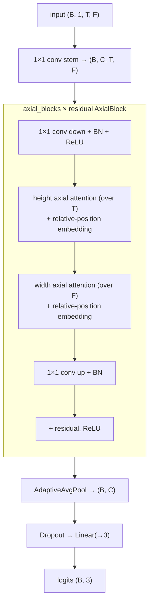

# Axial-LOB

Axial-attention classifier that treats the LOB window as an image and factorises 2D
attention into two 1D axial passes.

- **Reference:** Kisiel & Gorse, *Axial-LOB: High-Frequency Trading with Axial
  Attention* (arXiv:2212.01807), applying Axial-DeepLab (Wang et al., 2020) to LOB.
- **Type:** discriminative classifier.
- **Source:** `src/models/axiallob.py`
- **Trainer:** `crypto.train_axiallob`

## Idea

Full 2D self-attention over a `(T × F)` image is expensive. **Axial attention**
factorises it into a **height (time)** axial attention followed by a **width
(feature)** axial attention, each with a learnable **relative-position embedding**.
Channels are lifted by a 1×1 conv, processed by residual axial blocks, then
global-pooled to 3 logits.

Each `AxialAttention` is faithful to Axial-DeepLab: queries, keys and values each
carry a relative-position embedding, and the three similarity terms (content,
query–position, key–position) are gated by a shared BatchNorm.

## Architecture



## I/O

- **Input** `(B, 1, T_past, n_features)`
- **Output** `(B, 3)` trend logits.

## Config keys

| Key | Meaning | Default |
|-----|---------|---------|
| `axial_channels` | embedding channels for axial blocks | 32 |
| `axial_groups`   | attention heads (must divide channels; `channels/groups` must be even) | 8 |
| `axial_blocks`   | number of residual axial blocks | 2 |
| `axial_dropout`  | dropout before the head | 0.1 |

## Training

Supervised cross-entropy under the shared protocol.

```bash
uv run python -m crypto.train_axiallob configs/crypto/nobitex/axiallob/btcirt_ofi_k10.json
```
