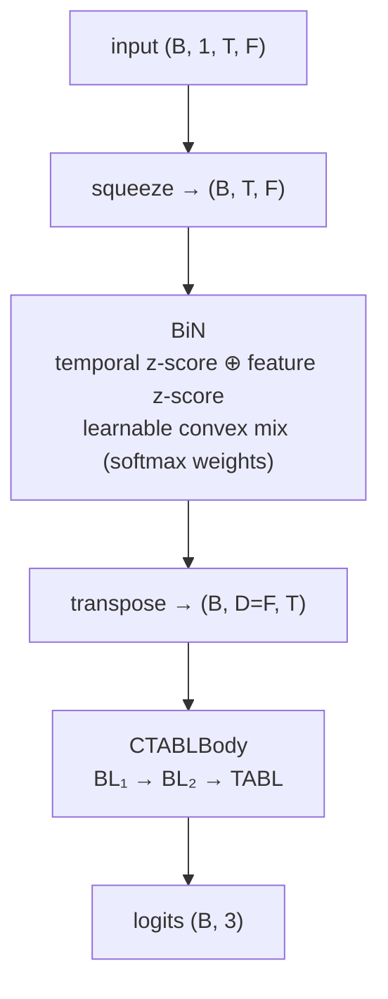

# BiN-CTABL

[CTABL](ctabl.md) with an adaptive **Bilinear Normalisation (BiN)** front-end.

- **Reference:** Tran, Kanniainen, Gabbouj & Iosifidis, *Data Normalization for
  Bilinear Structures in High-Frequency Financial Time-series*, ICPR 2020.
- **Type:** discriminative classifier.
- **Source:** `src/models/binctabl.py` (reuses `CTABLBody` from `ctabl.py`)
- **Trainer:** `crypto.train_binctabl`

## Idea

High-frequency LOB windows are non-stationary — level and scale drift across the
calendar-day train/val/test regimes. **BiN** normalises each window adaptively along
**both** modes and learns how much of each to trust:

- a **temporal** branch z-scores each feature across time,
- a **feature** branch z-scores each time step across features,
- the two are combined by a learnable softmax-weighted convex mix.

The normalised window then flows through the standard CTABL trunk. BiN adds no
hyperparameters of its own; the trunk reuses the CTABL keys.

## Architecture



## I/O

- **Input** `(B, 1, T_past, n_features)`
- **Output** `(B, 3)` trend logits.

## Config keys

Same as [CTABL](ctabl.md#config-keys) (`ctabl_d1`, `ctabl_d2`, `ctabl_t2`,
`ctabl_dropout`). BiN itself is parameter-light and needs no config.

## Training

Supervised cross-entropy under the shared protocol.

```bash
uv run python -m crypto.train_binctabl configs/crypto/nobitex/binctabl/btcirt_ofi_k10.json
```

> The same `BiN` layer is reused as an input front-end in [TLOB](tlob.md) and
> optionally in [JumpGateLOB](jumpgatelob.md).
