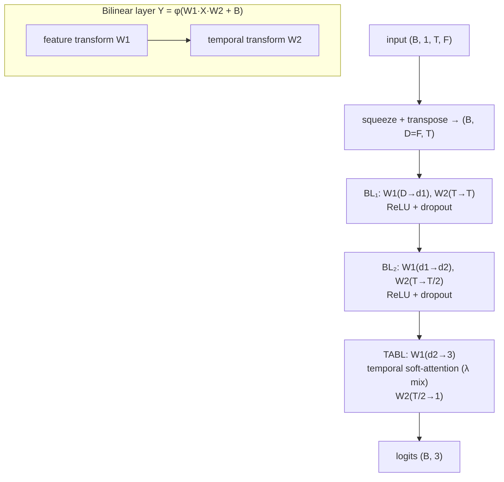

# CTABL

Temporal Attention-augmented Bilinear Network — operates directly on the
`(features × time)` matrix with bilinear layers that jointly transform both modes.

- **Reference:** Tran, Iosifidis, Kanniainen & Gabbouj, *Temporal Attention-Augmented
  Bilinear Network for Financial Time-Series Data Analysis*, IEEE TNNLS 2019.
- **Type:** discriminative classifier.
- **Source:** `src/models/ctabl.py`
- **Trainer:** `crypto.train_ctabl`

## Idea

Each layer applies **two** linear maps at once — one over the feature mode (`W1`) and
one over the temporal mode (`W2`) — so `Y = φ(W1·X·W2 + B)`. The final layer (`TABL`)
inserts a **temporal soft-attention** step between the two transforms, mixed back in
by a learnable scalar `λ`, letting the network emphasise informative time steps before
collapsing to a prediction.

The trunk stacks `BL → BL → TABL`, progressively reducing `(D, T) → (d1, T) →
(d2, T/2) → (3, 1)`.

## Architecture



The `TABL` attention: after the feature transform, a learnable `(t × t)` structure
matrix produces attention scores over time, softmaxed to `a`, then blended
`λ·(x⊙a) + (1−λ)·x` before the temporal transform. `CTABLBody` is the shared trunk
(also reused by [BiN-CTABL](binctabl.md)).

## I/O

- **Input** `(B, 1, T_past, n_features)` → transposed internally to `(B, D, T)`.
- **Output** `(B, 3)` trend logits.

## Config keys

| Key | Meaning | Default |
|-----|---------|---------|
| `ctabl_d1`      | features after BL₁    | 60 |
| `ctabl_d2`      | features after BL₂    | 120 |
| `ctabl_t2`      | time steps after BL₂  | `T_past // 2` |
| `ctabl_dropout` | dropout between layers| 0.1 |

## Training

Supervised cross-entropy under the shared protocol.

```bash
uv run python -m crypto.train_ctabl configs/crypto/nobitex/ctabl/btcirt_ofi_k10.json
```
