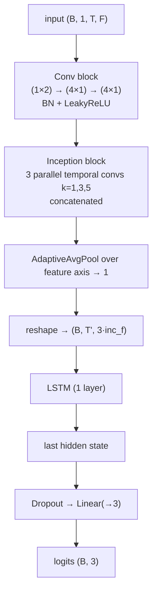

# DeepLOB

Convolutional + Inception + LSTM classifier — the canonical LOB deep-learning
baseline.

- **Reference:** Zhang, Zohren & Roberts, *DeepLOB: Deep Convolutional Neural
  Networks for Limit Order Books*, IEEE TSP 2019.
- **Type:** discriminative classifier.
- **Source:** `src/models/deeplob.py`
- **Trainer:** `crypto.train_deeplob`

## Idea

Treat the `(T_past × F)` window as a single-channel image. A convolutional stack
first mixes adjacent price/volume columns and compresses time, an Inception block
captures multi-scale temporal patterns in parallel, the feature axis is average-pooled
away, and an LSTM summarises the resulting sequence into a trend prediction.

## Architecture



## I/O

- **Input** `(B, 1, T_past, n_features)`
- **Output** `(B, 3)` trend logits.

## Config keys

| Key | Meaning | Default |
|-----|---------|---------|
| `deeplob_conv_filters`      | conv-block channels     | 32 |
| `deeplob_inception_filters` | per-path inception ch.  | 64 |
| `deeplob_lstm_hidden`       | LSTM hidden size        | 64 |
| `deeplob_dropout`           | dropout before the head | 0.1 |

## Training

Plain supervised classification — cross-entropy on the trend label, AdamW + warmup/
cosine LR, early stopping on validation cross-entropy (shared protocol, see
[README](README.md#shared-training-protocol)).

```bash
uv run python -m crypto.train_deeplob configs/crypto/binance/deeplob/btcusdt_ofi.json
```

> DeepLOB is also the only model wired for the equity (Feishu A-share) pipeline via
> `stocks.feishu.train_deeplob`.
