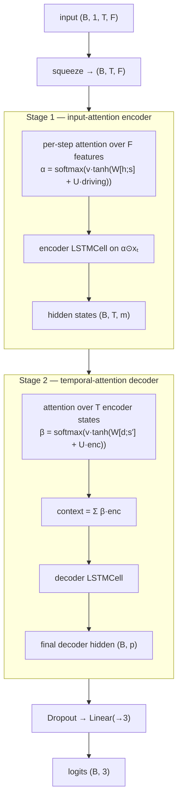

# DLA — Dual-Stage Temporal Attention

A dual-stage attention encoder/decoder LSTM (DA-RNN) applied to LOB windows.

- **Reference:** Guo & Chen, *Dual-Stage Temporal Attention* (2022), applying the
  DA-RNN of Qin et al. (2017) to limit-order-book data.
- **Type:** discriminative classifier.
- **Source:** `src/models/dla.py`
- **Trainer:** `crypto.train_dla`

## Idea

Two attention stages wrap an encoder/decoder LSTM pair:

- **Stage 1 — input attention (encoder).** At every time step, an attention over the
  `F` input ("driving") series reweights the features *before* they enter the encoder
  `LSTMCell`, conditioned on the previous encoder hidden + cell state. The model
  learns which features matter at each moment.
- **Stage 2 — temporal attention (decoder).** A decoder `LSTMCell` attends over all
  encoder hidden states, forming a context vector each step. The final decoder hidden
  state feeds a linear head → 3 trend logits.

## Architecture



## I/O

- **Input** `(B, 1, T_past, n_features)`
- **Output** `(B, 3)` trend logits.

## Config keys

| Key | Meaning | Default |
|-----|---------|---------|
| `dla_encoder_hidden` | encoder LSTM hidden `m` | 64 |
| `dla_decoder_hidden` | decoder LSTM hidden `p` | 64 |
| `dla_dropout`        | dropout before the head | 0.1 |

## Training

Supervised cross-entropy under the shared protocol. Note the two nested per-timestep
loops make DLA the slowest baseline per epoch.

```bash
uv run python -m crypto.train_dla configs/crypto/nobitex/dla/btcirt_ofi_k10.json
```
