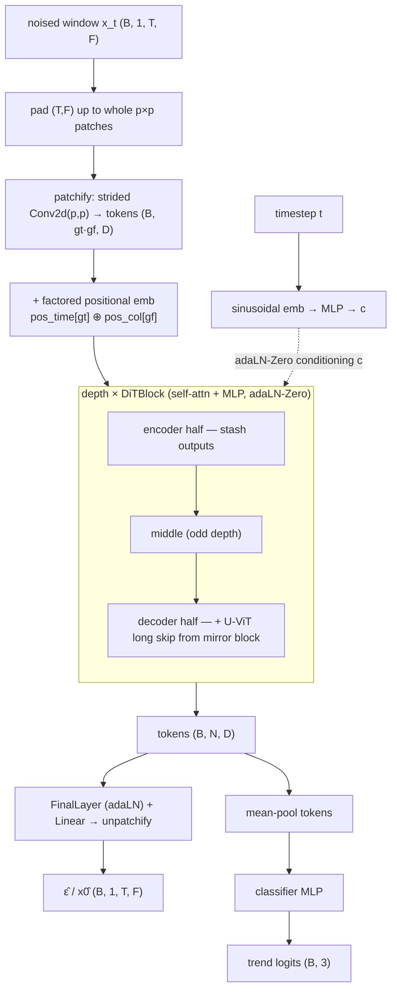

# JointDiT

The core of the project: a **Diffusion Transformer (DiT)** trained **jointly to
denoise and to classify**. One backbone, one shared representation — the generative
diffusion objective and the discriminative trend objective are optimised together, so
the features the classifier head reads are shaped by having to also reconstruct the
LOB window.

- **References:** joint objective — Deja et al., *Learning Data Representations with
  Joint Diffusion Models* (2023); backbone — Peebles & Xie, *Scalable Diffusion
  Models with Transformers* (DiT, 2023); with U-ViT additive long skips (Bao et al.,
  2023).
- **Type:** joint generative–discriminative.
- **Source:** `src/models/jointdit.py`
- **Trainers:** `crypto.train_jointdit` (base) + four variants + a two-phase probe
  (see [Training objectives](#training-objectives)).

## The joint idea

A single DiT backbone produces, from a (noised) LOB window:

- a **denoiser output** — either ε (DDPM) or an EDM-preconditioned clean-window
  reconstruction `x0_hat`, trained by a diffusion loss;
- **trend logits** — from mean-pooling the token sequence, trained by cross-entropy.

Sharing the trunk means the generative task regularises the classifier: the encoder
must represent the microstructure well enough to denoise it, which yields features
that transfer to direction prediction. At **inference only the classification path
runs** (a single forward pass on the clean window) — no sampling loop.

## Architecture



Key backbone choices:

- **Patchify** — non-overlapping `p×p` patches (strided conv) keep the token count
  `(T/p)·(F/p)` small; attention cost is quadratic in tokens.
- **Factored positional embeddings** over the patch grid: a time-patch table and a
  feature-patch table are broadcast-added, so patch `(i, j)` gets
  `pos_time[i] + pos_col[j]`.
- **adaLN-Zero** timestep conditioning — every block starts as identity (modulation
  weights zero-initialised), which stabilises early training.
- **U-ViT additive long skips** — encoder-half block `i` is added into decoder-half
  block `N−1−i`.

## Two forward contracts

The same backbone exposes two callables so different trainers can reuse it:

| Method | Returns | Used by |
|--------|---------|---------|
| `forward(x_t, t)`      | `(eps_hat, logits)` — raw ε-prediction network | DDPM base trainer |
| `denoise(x, sigma[, kappa])` | `(x0_hat, logits)` — EDM-preconditioned consistency function `f_θ` | consistency / t-EDM / drift / two-phase |

`predict(batch, device)` returns just `logits`: at `t = 0` (DDPM) or the denoised
`sigma_min` pass (consistency), depending on `cm_enabled`.

## I/O

- **Input** `(B, 1, T_past, n_features)`
- **Output (train)** diffusion target + `(B, 3)` logits; **(inference)** `(B, 3)`.

## Backbone config keys

| Key | Meaning | Default |
|-----|---------|---------|
| `jdit_patch`     | patch size `p`        | 4 |
| `jdit_dim`       | token dimension `D`   | 192 |
| `jdit_depth`     | number of DiT blocks  | 6 |
| `jdit_heads`     | attention heads       | 6 |
| `jdit_mlp_ratio` | MLP expansion         | 4.0 |
| `jdit_dropout`   | dropout               | 0.1 |
| `lambda_trend`   | weight of the trend loss | 1.0 |

EDM/consistency keys (`cm_*`, `tedm_nu`, `drift_*`) are listed with their objectives
below.

## Training objectives

All five variants share the **same JointDiT backbone** — only the *generative loss*
(and how the trend head couples to it) differs. This is the main axis of comparison
in the project.

### 1. Base — DDPM ε-prediction · `crypto.train_jointdit`

The reference joint objective on a linear-β DDPM schedule:

```
L = MSE(ε̂, ε)  +  lambda_trend · w(t) · CE(logits, label)
w(t) = (1 − t/T_max)²   if trend_taper else 1
```

`w(t)` optionally down-weights the trend loss at high noise. Inference reads logits
from the clean (`t = 0`) pass.

```bash
uv run python -m crypto.train_jointdit configs/crypto/nobitex/jointdit/btcirt_ofi_k10.json
```

### 2. Consistency model (CM) · `crypto.train_jointdit_cm`

Teacher-free **Consistency Training** (Song et al. 2023; improved: Song & Dhariwal
2023) under EDM preconditioning. The backbone becomes a consistency function
`f_θ(x, σ)` mapping any noised point back to the clean window:

```
L_consistency = λ(σₙ) · PseudoHuber( f_θ (x₀+σₙ₊₁ z, σₙ₊₁),  f_θ⁻(x₀+σₙ z, σₙ) )
```

over adjacent Karras levels sharing noise `z`. Adds: an **EMA target** `f_θ⁻`,
**annealed discretisation** `N(k)` (Karras levels grow during training),
**low-noise-only classification** (`σ < σ_data`), and **Kendall–Gal uncertainty
weighting** of the two losses. `σ_data` is measured from the training windows.
Inference reads logits from the denoised `σ_min` pass.

Keys: `cm_sigma_min`, `cm_sigma_max`, `cm_rho`, `cm_ema_decay`, `cm_s0`, `cm_s1`,
`cm_p_mean`, `cm_p_std`, `cm_sigma_data_auto`.

```bash
uv run python -m crypto.train_jointdit_cm configs/crypto/nobitex/jointdit_cm/btcirt_ofi_k10.json
```

### 3. t-EDM (heavy-tailed CM) · `crypto.train_jointdit_tedm`

Identical to CM but swaps the Gaussian diffusion core for **t-EDM** (Pandey et al.
2025) so the generative branch models the heavy tails of high-frequency crypto
returns. Via the Gaussian scale-mixture identity, Student-t noise is Gaussian scaled
by `√κ` with `κ ~ Inverse-Gamma(ν/2, ν/2)`, drawn once per sample and **shared across
both points** of each consistency pair. `ν` is the single tail knob (`tedm_nu` or
`--nu`); large `ν` → Gaussian EDM.

```bash
uv run python -m crypto.train_jointdit_tedm configs/crypto/nobitex/jointdit_tedm/btcirt_ofi_k10.json --nu 5
```

### 4. Drift (one-step generator) · `crypto.train_jointdit_drift`

*Generative Modeling via Drifting* (Lambert et al.). Instead of a noise schedule, the
DiT is trained as a **single-step generator** — apply the consistency map to pure
noise `x_gen = f_θ(σ_max·z, σ_max)` — whose output distribution is *drifted* toward
the data via a multi-scale kernel force field (attracted to real windows from a
`WindowMemoryBank`, optionally repelled from past generations). The trend head is
trained jointly on clean real windows:

```
L = drift_loss(φ(x_gen), φ(x_pos), φ(x_neg)) + lambda_trend · CE(logits, label)
```

Keys: `drift_r_list`, `drift_pos_per_sample`, `drift_neg_per_sample`,
`drift_pos_bank`, `drift_neg_bank` (+ `cm_sigma_max`). Implemented in `models/drift.py`.

```bash
uv run python -m crypto.train_jointdit_drift configs/crypto/nobitex/jointdit_drift/btcirt_ofi_k10.json
```

### 5. Lévy jump-diffusion · `crypto.train_jointdit_levy`

A finite-activity **jump-diffusion** forward process (Baule 2025): the DiT output is
reinterpreted as the **generalized score** of a non-Gaussian kernel. The kernel is a
Gaussian scale mixture (Brownian variance + compound-Poisson gamma jumps), so its
isotropic score collapses to a cheap precomputed 1-D table (`src/levy/`). Denoising
stays an MSE against that tabulated score; trend CE is applied on low-noise samples
only. Ablation toggle `diffusion_process = levy | gaussian`.

```
L = w̄_t · ‖ ŝ(x_t,t) − ∇log q(x_t|x_0) ‖²  +  lambda_trend · CE(logits, label)
```

Keys: `diffusion_process`, `schedule` (`vp`/`ve`), `levy_jump_rate`,
`levy_gamma_shape`, `levy_gamma_scale`, `levy_table_num_r`, `levy_table_mc`. See
[JumpGateLOB](jumpgatelob.md) for more on the Lévy forward process.

```bash
uv run python -m crypto.train_jointdit_levy configs/crypto/nobitex/jointditlevy/btcirt_ofi_k10.json
```

### Two-phase probe · `crypto.train_2phase_diffusion`

A **decoupled** alternative (`models/probe.py`) that never shares a loss between the
tasks: **Phase 1** trains the JointDiT trunk on a single generative objective
(`objective: edm` or `drift`, classifier excluded); **Phase 2** freezes the trunk and
trains only a small probe (temporal aggregator + MLP) on intermediate block
activations tapped from one preconditioned forward pass per swept `σ`. It measures how
linearly-decodable the *purely generative* features are. Config lives under
`configs/*/twophase/*_dit_{edm,drift}.json`.

```bash
uv run python -m crypto.train_2phase_diffusion configs/crypto/nobitex/twophase/btcirt_ofi_k10_dit_edm.json
```

## Supporting modules

| Module | Role |
|--------|------|
| `models/ddpm.py`        | linear-β DDPM `add_noise` (base trainer) |
| `models/consistency.py` | EDM preconditioning, Karras σ grid, Pseudo-Huber, `N(k)` annealing, `κ` sampling (CM / t-EDM) |
| `models/drift.py`       | multi-scale kernel drift loss + `WindowMemoryBank` |
| `src/levy/`             | Lévy forward process + tabulated generalized score |
| `models/probe.py`       | two-phase trunk-feature extractor + temporal probe |
