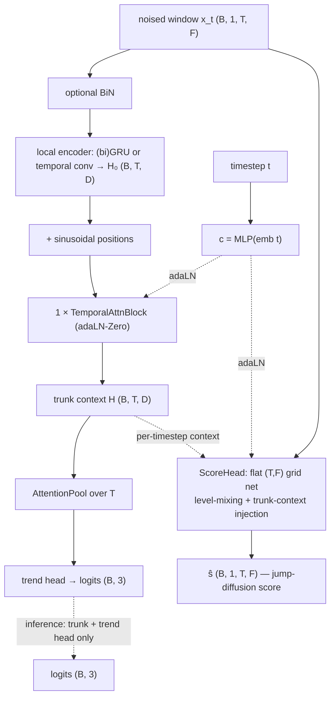

# JumpGateLOB

A **jump-diffusion score-matching joint classifier** built for LOB windows that are
**noisy and contain jumps**. The architecture is deliberately simple — the same shape
as [AlphaStableLOB](alphastablelob.md) — and all of the jump machinery lives in the
*training procedure*: the forward noise is a Lévy **jump-diffusion**, the diffusion
head regresses that kernel's **generalized score**, and the trend head is trained with
a **noise-consistency** pass so the inference path itself tolerates noise and jumps.

- **References:** generalized (jump-diffusion) denoising score matching — Baule 2025
  (arXiv:2503.06558); joint diffusion (Deja et al. 2023); clean/noisy prediction
  consistency for robustness (consistency-regularization line of work).
- **Type:** joint generative–discriminative.
- **Source:** `src/models/jumpgatelob.py` · forward process `src/levy/`
- **Trainer:** `crypto.train_jumpgatelob`

## The idea

A **shared trunk** (run once per pass) feeds two heads:

- **trend head** — attention-pool over `T` → 3 logits. **Inference runs only the trunk
  + this head on the clean window** — no reverse sampling.
- **score head** — a flat `(T, F)` grid net predicting the jump-diffusion **score**
  `ŝ (B, 1, T, F)` (single channel; a training-time auxiliary).

The trunk is deliberately shallow-global: a **(bi)GRU local encoder** for order-aware
per-timestep context, then **one** DiT-style **temporal self-attention** layer,
adaLN-Zero conditioned on the timestep embedding. No noise-state estimator, no gated
experts, no `w_conditioning` — the earlier gated variant is preserved in git history.

## Architecture



## The jump-diffusion forward process (`src/levy/`)

The additive perturbation at timestep `t` is a **Gaussian scale mixture**:

```
u = x_t − a_t·x₀ = √W · ξ ,   ξ ~ N(0, I)
W = σ_t²  +  Σ_{k=1}^{N} S_k ,   N ~ Poisson(Λ_t) ,   S_k ~ Gamma(shape, scale)
```

— Brownian variance plus **compound-Poisson gamma jumps**, so training perturbations
look like market microstructure noise *and* discrete jump events. Because the kernel
is a scale mixture, its isotropic score collapses to a precomputed 1-D table:
`∇log q(x_t|x₀) = −u·h(|u|)`, `h(r) = E[1/W | r]` (Monte-Carlo over `W`).
`Λ_t = 0` recovers the exact Gaussian score — the `--process gaussian` ablation.

## Training objective

Joint, with **separate passes**; all three terms are always active:

```
L_cls    = CE(classify(x₀), label)                       # clean pass, t = 0
L_score  = w̄_t · ‖ ŝ(x_t, t) − ∇log q(x_t|x₀) ‖²         # generalized score matching
L_robust = CE(classify(x̃), label)                        # jump-noised low-t pass
L        = L_cls + λ_diff·L_score + μ_robust·L_robust
```

- **`L_score`** shapes the trunk on jump-diffusion perturbations; the per-sample weight
  `w̄_t = E[W_t] = σ_t² + Λ_t·shape·scale` keeps the target O(1) at every timestep.
- **`L_robust`** is the piece that makes the *inference path* robust: `x̃` is the same
  jump-diffusion forward applied at a **low `t`** (the SNR ≥ 1 region, so the label is
  still recoverable), classified at the head's `t = 0` conditioning — deployment never
  knows the noise level.

Model selection / early stopping on **trend-head macro-F1** (feature-only). Each epoch
also logs `noisy_val_f1` — macro-F1 on jump-noised validation windows — the robustness
metric `L_robust` is trying to move, alongside the train/val F1 gap.

### Modes

| Flag | Behaviour |
|------|-----------|
| *(default)* | joint — all three losses each step |
| `--process gaussian` | ablation: Brownian-only forward (no jumps) |
| `--baseline` | plain classifier — `L_cls` only |

## I/O

- **Input** `(B, 1, T_past, n_features)`
- **Output (train)** `(ŝ, logits)`; **(inference)** `(B, 3)` logits from the
  clean-window trunk pass.

## Config keys

Trunk: `jgl_local` (`gru`/`conv`), `jgl_gru_hidden`, `jgl_gru_layers`,
`jgl_bidirectional`, `jgl_attn_heads`, `jgl_diff_channels`, `jgl_diff_blocks`,
`jgl_feat_mix` (`attn`/`conv`), `jdl_time_emb`, `jdl_pool_heads`, `use_bin`,
`cls_dropout`.
Forward / losses: `diffusion_process` (`levy`/`gaussian`), `schedule`, `T_max`,
`levy_jump_rate`, `levy_gamma_shape`, `levy_gamma_scale`, `levy_table_num_r`,
`levy_table_mc`, `lambda_diff`, `mu_robust`, `label_smoothing`.

## Run

```bash
uv run python -m crypto.train_jumpgatelob configs/crypto/nobitex/jumpgatelob/btcirt_ofi_k10.json
uv run python -m crypto.train_jumpgatelob ... --process gaussian   # no-jump ablation
uv run python -m crypto.train_jumpgatelob ... --baseline           # plain-classifier reference
```
