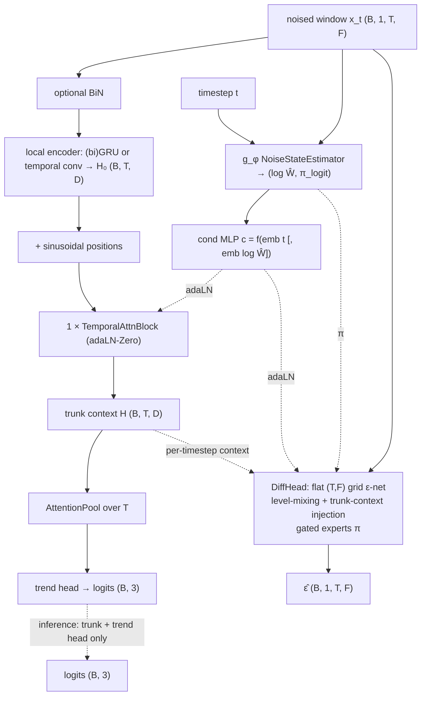

# JumpGateLOB

A **Lévy, jump-aware joint diffusion-classifier** designed specifically for
**feature-only trend inference**. Leaner than a deep joint diffusion stack: the global
temporal coupling is a *single* temporal-attention layer on top of a local recurrent
encoder, with a small grid diffusion head sharing the trunk.

- **References:** joint diffusion (Deja et al. 2023); Lévy / jump-diffusion score
  (Baule 2025); noise-state / heavy-tail modelling in the "JumpGate" family.
- **Type:** joint generative–discriminative.
- **Source:** `src/models/jumpgatelob.py`
- **Trainer:** `crypto.train_jumpgatelob`

## The idea

A **shared trunk** (run once per pass) feeds two heads:

- **trend head** — attention-pool over time → 3 logits. **Inference runs only the
  trunk + this head on the clean window** — no reverse sampling.
- **diffusion head** — a small flat `(T, F)` grid ε-predictor conditioned on the trunk
  context, with **gated experts** `ε̂ = (1−π)ε₀ + π·ε₁`.

The trunk is deliberately shallow-global: a **(bi)GRU local encoder** for order-aware
per-timestep context, then **one** DiT-style **temporal self-attention** layer for
global coupling. `(t, log Ŵ)` are injected by adaLN-Zero.

**Lévy machinery** carried by the JumpGate family: a `NoiseStateEstimator` (`g_φ`)
infers `(log Ŵ, π_logit)` — the realized mixing variance and a jump indicator — from
the noised window. `W` comes from a Lévy jump-diffusion forward process (Gaussian
scale mixture; `src/levy/`), and the score is recovered as `−ε/W`. The
`w_conditioning ∈ {none, inferred, oracle}` switch controls whether/what `Ŵ`
conditions the denoiser (with all defaults, it reduces to a plain ε-prediction joint
model).

## Architecture



## I/O

- **Input** `(B, 1, T_past, n_features)`
- **Output (train)** `ε̂`, logits, `log Ŵ`, `π_logit`; **(inference)** `(B, 3)` logits
  from the clean-window trunk pass.

## Training objective

Joint, with **separate passes** so the trend head always sees the clean-window
distribution it will see at inference:

```
L_cls  = CE(classify(x₀), label)                 # clean pass, t = 0
L_diff = ‖ ε̂ − ε ‖²                              # noised pass, sampled t
L_W    = MSE(log Ŵ, log W) + BCE(π_logit, jump_flag)     # trains g_φ
L_jump = BCE(π_logit, data_jump)                 # self-supervised market-jump nudge
L      = L_cls + λ_diff·L_diff + μ_W·L_W + μ_jump·L_jump
```

`(x_t, ε, W, jump_flag)` come from the Lévy forward process (`fp.add_noise_eps`, or a
Gaussian bypass). `g_φ` outputs are detached everywhere except `L_W` / `L_jump`.
**Model selection and early stopping are on trend-head macro-F1** (feature-only), not
denoising MSE, and both train/val F1 are logged so the noise-fitting gap is visible.

### Modes

| Flag | Behaviour |
|------|-----------|
| *(default)* | joint — all losses each step |
| `--process gaussian` | ablation: Gaussian forward process instead of Lévy |
| `--baseline` | plain classifier — `L_cls` only, no diffusion / `g_φ` |
| `--baranchuk` | two-phase diagnostic — phase 1 diffusion only, phase 2 freeze trunk + train trend head on frozen features |

## Config keys

Backbone: `jgl_local` (`gru`/`conv`), `jgl_gru_hidden`, `jgl_gru_layers`,
`jgl_bidirectional`, `jgl_attn_heads`, `jgl_diff_channels`, `jgl_diff_blocks`,
`jgl_feat_mix` (`attn`/`conv`), `jdl_time_emb`, `use_bin`.
JumpGate: `w_conditioning` (`none`/`inferred`/`oracle`), `gated_experts`,
`gate_grad`, `jg_gphi_hidden`.
Loss: `lambda_diff`, `mu_W`, `mu_jump`, `jump_rv_k`.
Lévy forward: `diffusion_process`, `schedule`, `levy_jump_rate`, `levy_gamma_shape`,
`levy_gamma_scale`.

## Run

```bash
uv run python -m crypto.train_jumpgatelob configs/crypto/nobitex/jumpgatelob/btcirt_ofi_k10.json
uv run python -m crypto.train_jumpgatelob ... --baseline    # plain-classifier reference
```

> Configs ship for **Nobitex** (`configs/crypto/nobitex/jumpgatelob/`).

## The Lévy forward process (`src/levy/`)

Shared with [JointDiT-Lévy](jointdit.md#5-lévy-jump-diffusion--cryptotrain_jointdit_levy).
The additive perturbation at step `t` is `u = √W · ξ`, `ξ ~ N(0, I)`, with

```
W = σ_t²  +  Σ_{k=1}^{N} S_k,   N ~ Poisson(Λ_t),   S_k ~ Gamma(shape, scale)
```

— a Brownian variance plus a compound-Poisson sum of gamma subordinators. Because the
whole kernel is a **Gaussian scale mixture**, its isotropic score
`∇log q = −u·h(|u|)` needs only a 1-D table `h(r) = E[1/W | r]`, precomputed offline by
Monte-Carlo over `W` (`levy.diffusion.build_score_table`). `Λ_t = 0` recovers the
ordinary Gaussian score exactly. JumpGateLOB uses the **ε-prediction** path (the score
table is bypassed with `table_num_r = 1`); JointDiT-Lévy uses the tabulated score
directly.
