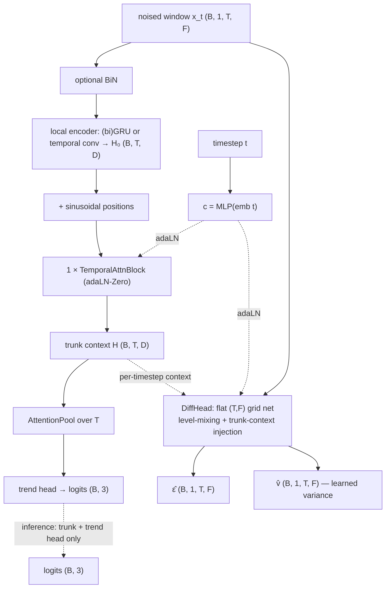

# StableLOB

A joint diffusion-classifier that reuses [JumpGateLOB](jumpgatelob.md)'s **trunk idea**
(BiN → GRU local encoder → one temporal-attention layer, feature-only inference) but
swaps the Lévy ε-prediction for the **improved-DDPM** noise/denoise recipe — cosine
schedule, learned reverse variance, and a hybrid objective.

> **Name.** "Stable" refers to the *training stability* the improved-DDPM likelihood
> weighting buys (learned variance + cosine schedule). It is **not** latent Stable
> Diffusion — there is no VAE / latent space; the model diffuses the raw feature window
> directly.

- **References:** Nichol & Dhariwal, *Improved Denoising Diffusion Probabilistic
  Models* (2021, [openai/improved-diffusion](https://github.com/openai/improved-diffusion));
  joint diffusion (Deja et al. 2023).
- **Type:** joint generative–discriminative.
- **Source:** `src/models/stablelob.py` · diffusion math `src/models/iddpm.py`
- **Trainer:** `crypto.train_stablelob`

## What's different from JumpGateLOB

Same shared-trunk philosophy, different generative branch:

| | JumpGateLOB | **StableLOB** |
|---|---|---|
| Noise schedule | linear-β (VP) | **cosine** ᾱ(t) |
| Forward kernel | Lévy jump-diffusion (Gaussian scale mixture) | plain Gaussian |
| Denoiser output | ε (+ jump gate π, gated experts) | **(ε̂, v̂)** — noise + variance |
| Reverse variance | fixed | **learned** (LEARNED_RANGE) |
| Diffusion loss | ‖ε̂ − ε‖² + noise-state terms | **hybrid** `L_simple + λ·L_vlb` |
| Inference | trunk + trend head on clean window | *identical* |

## The idea

A **shared trunk** (run once per pass) feeds two heads:

- **trend head** — attention-pool over `T` → 3 logits. **Inference runs only the trunk
  + this head on the clean window** — no reverse sampling.
- **diffusion head** — a flat `(T, F)` grid net predicting **two** channels per
  element, `(ε̂, v̂)`: the noise (mean) and the variance-interpolation fraction.

The generative denoising loss regularizes the trunk; the classifier reuses the
resulting features. The trunk is deliberately shallow-global: a **(bi)GRU local
encoder** for order-aware per-timestep context, then **one** DiT-style **temporal
self-attention** layer, adaLN-Zero conditioned on the timestep embedding.

## Architecture



## The improved-DDPM noise/denoise (`models/iddpm.py`)

`ImprovedDiffusion` holds the schedule + math (no parameters), passed to the trainer
like the DDPM scheduler for JointDiT.

- **Cosine schedule** — `ᾱ(t) = cos((t/T + s)/(1+s)·π/2)²`, `s = 0.008`,
  `β_i = min(1 − ᾱ(t₂)/ᾱ(t₁), 0.999)`. Gentler noising early/late than linear-β.
- **Learned reverse variance (LEARNED_RANGE)** — from the predicted `v̂`,
  `log Σ_θ = frac·log β_t + (1−frac)·log β̃_t`, `frac = (v̂+1)/2`, interpolating
  between the true-posterior variance `β̃_t` and `β_t`.
- **Hybrid loss** `L = L_simple + λ_vlb·L_vlb`:
  - `L_simple = MSE(ε̂, ε)` trains the **mean**,
  - `L_vlb` (KL for `t>0`, decoder NLL at `t=0`) trains **only the variance** — the
    mean is stop-gradded inside the VLB (the IDDPM trick that keeps the bound from
    swamping the simple loss).
- **LOB adaptation** — data are continuous z-scored features, not 8-bit images, so the
  `t=0` term uses a **continuous Gaussian NLL** (not IDDPM's 256-bin discretized
  likelihood) and `x₀` is left unclamped.

## Training objective

Joint, with **separate passes** so the trend head always sees the clean-window
distribution it will see at inference:

```
L_cls    = CE(classify(x₀), label)                    # clean pass, t = 0
L_hybrid = MSE(ε̂, ε) + λ_vlb · VLB(ε̂.detach, v̂)       # noised pass, sampled t
L        = L_cls + λ_diff · L_hybrid
```

Model selection and early stopping are on **trend-head macro-F1** (feature-only), not
the diffusion loss; `train_f1`/`val_f1` and their gap are logged. `--baseline` runs
`L_cls` only (no diffusion head) as a plain-classifier reference.

## I/O

- **Input** `(B, 1, T_past, n_features)`
- **Output (train)** `(ε̂, v̂, logits)`; **(inference)** `(B, 3)` logits from the
  clean-window trunk pass.

## Config keys

Trunk: `stable_local` (`gru`/`conv`), `stable_gru_hidden`, `stable_gru_layers`,
`stable_bidirectional`, `stable_attn_heads`, `stable_diff_channels`,
`stable_diff_blocks`, `stable_feat_mix` (`conv`/`attn`), `stable_time_emb`,
`stable_pool_heads`, `use_bin`.
Diffusion / loss: `T_max` (timesteps), `cosine_s`, `lambda_diff`, `lambda_vlb`,
`cls_dropout`, `label_smoothing`.

## Run

```bash
uv run python -m crypto.train_stablelob configs/crypto/nobitex/stablelob/btcirt_ofi_k10.json
uv run python -m crypto.train_stablelob ... --baseline    # plain-classifier reference
```
