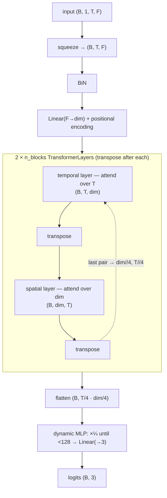

# TLOB

Temporal-LOB transformer with **alternating temporal / spatial attention**.

- **Reference:** *TLOB: A Novel Transformer Model for Price Trend Prediction from
  Limit-Order-Book data* (faithful re-implementation).
- **Type:** discriminative classifier.
- **Source:** `src/models/tlob.py`
- **Trainer:** `crypto.train_tlob`

## Idea

After a `BiN` normalisation and a linear projection to model dimension `dim` (plus
positional encoding), TLOB alternates two kinds of self-attention by **transposing
the sequence/embedding axes after every layer**:

- **even** layers attend over **time** on `(B, T, dim)`,
- **odd** layers attend over the **feature/embedding** axis on `(B, dim, T)`.

This lets the model mix along both the temporal and cross-feature directions with
ordinary transformer layers. The last block pair shrinks the two axes (to `dim//4`
and `T//4`), then a dynamic MLP flattens and reduces to 3 logits.

## Architecture



Each `TransformerLayer` expands Q/K/V to `dim × heads` (so each head sees the full
token), runs MHA, projects back to `dim`, applies a post-norm residual, then a
`dim → 4·dim → final_dim` MLP with a residual only when dimensions match.

## I/O

- **Input** `(B, 1, T_past, n_features)` (or `(B, T, F)`).
- **Output** `(B, 3)` trend logits.

## Config keys

| Key | Meaning | Default |
|-----|---------|---------|
| `tlob_dim`      | model dimension `dim`      | 64 |
| `tlob_n_blocks` | number of block pairs      | 2 |
| `tlob_n_heads`  | attention heads            | 1 |
| `tlob_sin_emb`  | sinusoidal PE (else learnable) | true |

## Training

Supervised cross-entropy under the shared protocol.

```bash
uv run python -m crypto.train_tlob configs/crypto/nobitex/tlob/btcirt_ofi_k10.json
```
